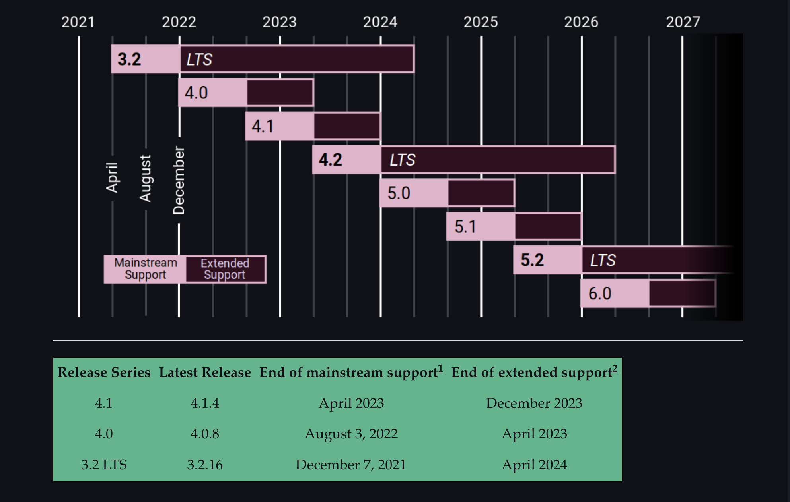
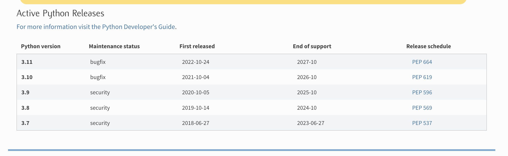

# PIXEL WORLD

# Django and Python Version for project.

    Django - 4.2.2
    Python - 3.11.4

***

## LTS support for Django.

***

## LTS support for Python

***

***
Social Website : Created a website to bookmark and share images.

1. Implement authentication using the Django authentication framework
2. Extend the user model with a custom profile model
3. Use the Diango messages framework
4. Build a custom authentication backend
5. Implement social authentication (OAuth2) with Facebook, Twitter, and Google using Python Social Auth
6. Use django-extensions to run the development server through HTTPS
7. Generate image thumbnails with easy-thumbnails
8. Implement many-to-many relationships in models
9. Build a JavaScript bookmarklet with JavaScript and Django
10. Add asynchronous HTTP requests with the JavaScript Fetch API and Django
11. Implement infinite scroll pagination
12. Build a user follow system
13. Create a user activity stream and optimize QuerySets
14. Learn to use Django signals
15. Use django-debug-toolbar to obtain relevant debug information
16. Count image views with Redis
17. Build an image ranking with Redis

# Dev Note:

***

